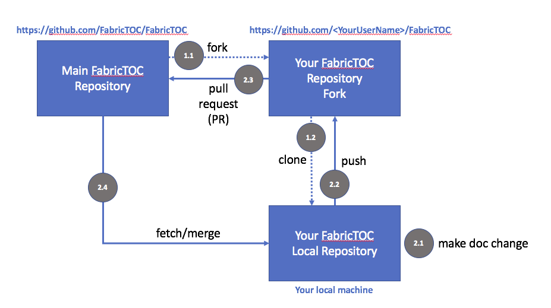

# FabricTOC

This repository is a working area for the Hyperledger Fabric Documentation Workgroup to develop the Table of Contents (TOC) for the Operations Guide section of the Hyperledger Fabric documentation https://hyperledger-fabric.readthedocs.io/en/latest/.

Its purpose is to facilitate collaborative development of the Operations/Administration Guide section of the documentation, such that it can be included in the Hyperledger Fabric documentation repository.

It uses markdown to help documentation developers easily edit and view their changes on their local machine while maintaining source control through GitHub.

We recommend using ATOM (https://atom.io/), or editors with similar previewing facilities, to help develop this content.

The working copy of the Administration Guide is [here](./docs/AdminGuide/AdminGuide.md)

We welcome comments on the documentation.  Just raise an [issue](https://github.com/FabricTOC/FabricTOC/issues)!

Or if you'd like to propose changes then use the [following process](#GitHubProcess).

# <a name="GitHubProcess"></a> How to contribute to this documentation



As you can see, the main repository for the FabricTOC is held on GitHub at https://github.com/FabricTOC/FabricTOC. This is where all agreed changes are held. These changes are agreed by the maintainers of the FabricTOC organization.  

Whenever you'd like to contribute to the documentation, you first make a change in your local fork of the repository, which you typically edit on your local machine. Once you're happy with this change, you can request that it is included in the main repository, and everyone else can then work from it.

There are two phases to this process. Firstly, setting up your local fork on GitHub (1.1) and creating a clone of this repository on your local machine (1.2). This setup phase is only done once.  The second phase is the normal mode of working - you make a change on your local machine (2.1), and when you're happy with it, you push it to your local fork (2.2), where it's safely stored in GitHub.  Once you're happy with all your changes, you request that they are included into the main repository via a pull request (a "PR", 2.3).  Once your changes, and more importantly, other peoples' changes have been included in the main repository, you can fetch those to your local machine, merge them with yours (2.4), and repeat the process (2.1).  

## <a name="SetUpProcess"></a> Setting up your machine for documentation

1. You'll need a GitHub id, which you can get [here](https://github.com/).

2. Navigate to the [main repository](https://github.com/FabricTOC/FabricTOC) and fork a copy to your GitHub user name

3. Clone a copy to your local machine using SSH or HTTPS: (These examples use SSH)

  `cd <top level git work directory>`

  `git clone git@github.com:<YourUserName>/FabricTOC.git`  

  Whenever you now do a git push, it will be uploaded to your local fork

4. Set your local copy of the project to fetch from the main repository, using either SSH or HTTPS.  

  `cd FabricTOC`

  `git remote add upstream git@github.com:FabricTOC/FabricTOC.git`

5. Verify that your repository references have been set up correctly.

  `git remote -v`

  should display

  ```
origin	git@github.com:<YourUserName>/FabricTOC.git (fetch)
origin	git@github.com:<YourUserName>/FabricTOC.git (push)
upstream	git@github.com:FabricTOC/FabricTOC.git (fetch)
upstream	git@github.com:FabricTOC/FabricTOC.git (push)
  ```

6. Make a small change to the README.md file and commit it to your local git repository

  `git add .`

  `git commit -m "My first FabricTOC change"`

7. Push this change to your repository fork

  `git push origin master`

8. View this on your local repository fork, `https://github.com/<YourUserName>/FabricTOC.`

9. Make a Pull request at `https://github.com/<YourUserName>/FabricTOC/pulls`

10. Fetch the updates from the latest copy of the main repository

  `git fetch upstream`

  `git checkout master`

  `git merge upstream/master`

That's everything you need to know! You're able to propose changes the the FabricTOC.  Good luck!
