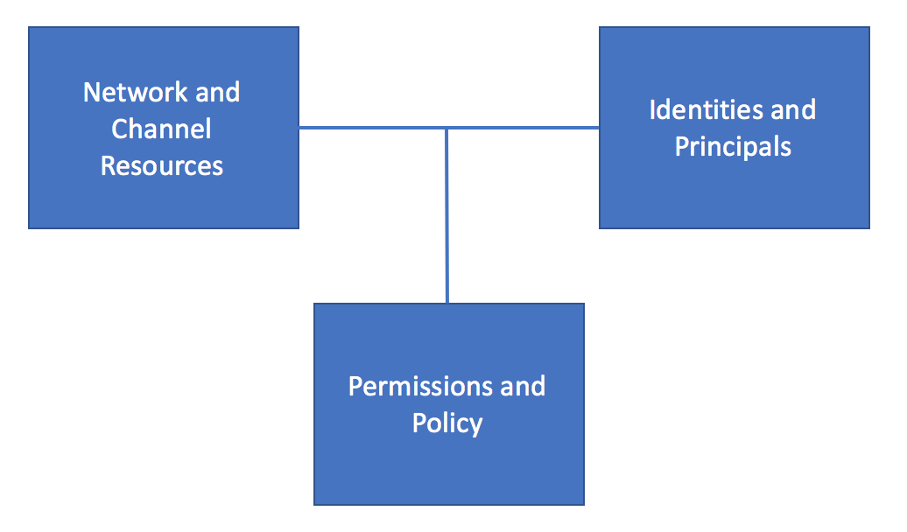
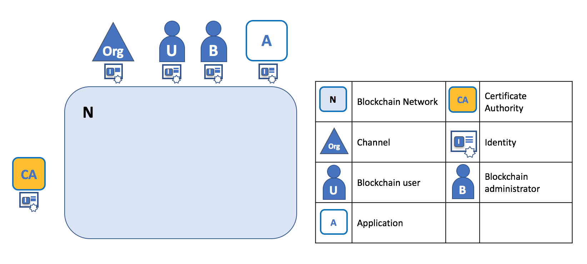
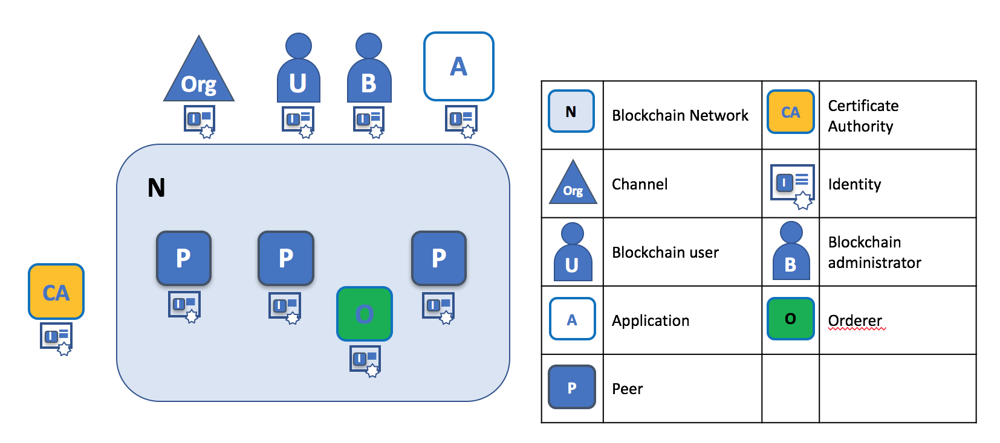

# A Blockchain network

## Think: Network, Identity and Permission

Hyperledger Fabric is a technology designed to address the diverse needs of the multiple organizations who collaborate in a blockchain network. Because of the many requirements that arise in these networks, **Hyperledger Fabric has a rich set of concepts** that you may initially find overwhelming! Don't worry though -- the principles that underly these concepts are easy to understand if you group them into three categories: **Network**, **Identity** and **Permission**.

|  |
| :---: |
| Three major concept groups in Hyperledger Fabric: Network, Identity and Permission |

Let's help you understand these categories by introducing some of the key concepts in each one. You don't need to understand every new idea -- but do try to get a feeling for the categories and why they are important.

## Network

Think of the concepts in this category as the fundamental **building blocks** of a blockchain network. **Cooperating organizations** form the blockchain network from these fundamental building blocks in order to **provide services** for **service consumers**.  As well as the organizations who formed the network, there will be a much larger set of participants who consume network services.

||
| :---: |
| Some of the building blocks of a Hyperledger Fabric blockchain network. |

You'll see that a **network** is partitioned into **channels** that enable private communications between the different members of a **consortium**. Moreover, within a channel, you'll see that **ledgers** and **smart contracts** are hosted on **peers** which endorse and validate transactions that are sequenced and distributed by **orderers**.

You'll learn more about these resources as you read the [Concepts](./KeyConcepts.md) section and try out the real-world [DRIVENET example](../HowOrganized/DriveNetSample.md). For now, just think of these resources as the most fundamental elements which form the network.

## Identity

**Every thing** and everyone that consume services of a Hyperledger Fabric network **requires an identity**.  For example you'll see that **users**, **administrators**, **applications**, **Certificate Authorities** and **organizations** all have to identify themselves whenever they interact with the network. Hyperledger Fabric has a general term for anything that has an identity -- a principal. **Principals are the main consumers of the network**.

|  |
| :---: |
| Principals with identity are the consumers of the network in Hyperledger Fabric  |

You'll see that sometimes **network resources** -- the fundamental building blocks -- **have an identity too**. That's because one part of the network can sometimes consume services from a different part of the network. For example, you'll see that peers and orderers use channel services to communicate with between themselves and applications. Because of this relationship between the components of the network, network resources can also be principals in the network.

|  |
| :---: |
| Some of the building blocks of a Hyperledger Fabric can also be principals -- they have identity |

You'll discover why identities and principals are important in a moment, and later on, you'll start to understand the importance of a **public key infrastructure** (PKI) to **establish trusted identities** for the principals in the network. But for now, just remember that there are lots of identities associated with a network.

## Permission

**Permissions are the final piece of the Hyperledger Fabric puzzle**, and are the concept that make Hyperledger Fabric different from most other blockchains.   

**Permissions are described in configuration policies which define the rights of different principals over different resources**. For example, applications may have permission to read from a ledger, but not to write to it. Similarly, administrators may have permission to change the organizations participating in a channel, but not the organizations who are defined in a consortium. As you can see from the diagram, permissions are associative -- they require both resources and identities to exist before they can be defined. That's because they define the relationship between principals and resources, and only make sense once both these elements exist.

| :---: |
| Examples of network and channel permissions. A network policy which defines how three different principals can control the organizations in a consortium. A channel policy which determines how three different principals can access the channel, and resources connected to it|

There are two types of permissions policy that can be defined in Hyperledger Fabric - **network permissions** and **channel permissions**.  
* **Network permissions** relate to those resources that operate across the whole network. For example, a network permission might control which organization can the define the members of a network consortium. Additionally, a network permissions can control which organizations can define channels between consortium members.  
* **Channel Permissions** relate to those resources that relate to an individual channel rather than the whole network. For example, a channel permission might determine which applications can read and write to the channel's ledger.  Alternatively, a channel permission might determine which administrators can remove an existing organization from the channel altogether.

Hyperledger Fabric makes **extensive use of permissions** to support **networks with different constitutions**. For example, a network can be defined where every organization has equal permissions over resources. At the other extreme, a network can be set up where a single organization has overall control.

Most powerfully, policies may also define the rights to **modify the current policy** -- to support the fact that organizations may adapt and evolve their relationships with each other over time. For example, a network which was initially configured with three organizations, two of which can control it, could be modified by either of the these two organizations to grant the third organization equal rights.

On a conceptual level, it's important to remember that permissions are what's important, because they enable any **instance** of a principal in the network to do something. For example, when Hyperledger Fabric is trying to determine whether a peer or an application or a Certificate Authority is allowed to do something, what matters is the identity that principal brings to the network, and the permissions associated with it. Although in the real world certain permissions are likely to be associated with certain **types** of components, the flexibility and extensibility of Hyperledger's approach makes it possible to give a Certificate Authority the permission to query the ledger, for example, which is not something it would normally do.

While this provides the greatest degree of flexibility to the founders and administrators of a Hyperledger Fabric network, it means that the permissions policy in the network must be defined very carefully.

## That's it!

That was easy, wasn't it? We can summarize Hyperledger Fabric as a technology which helps users build blockchain network, which is consumed by principals with identities, with agreed and evolving rights over the different types of resources that make up the network.

And if you think about it for a little while, any computer system can be described in this way - a set of resources, principals, and permissions.  The thing we now need to do is understand the concepts in more details, and how they interact with each other!

[Next:Consortia](./Consortia.md)
