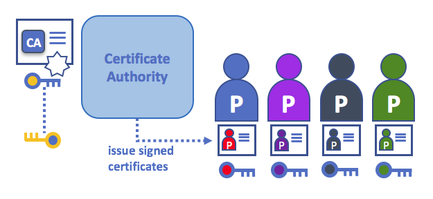
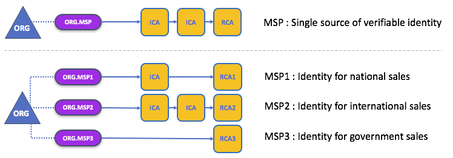
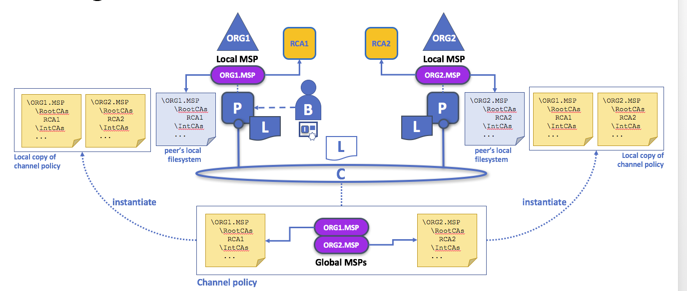
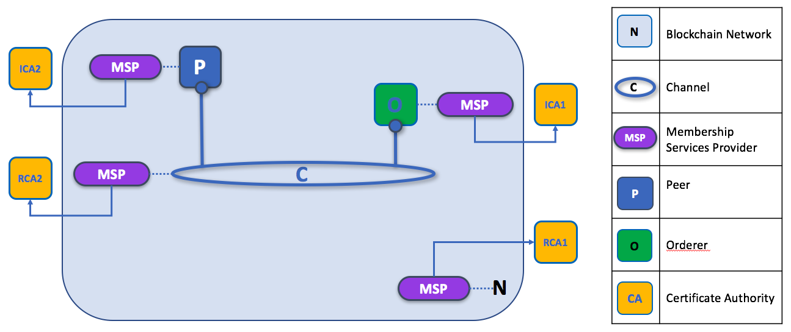
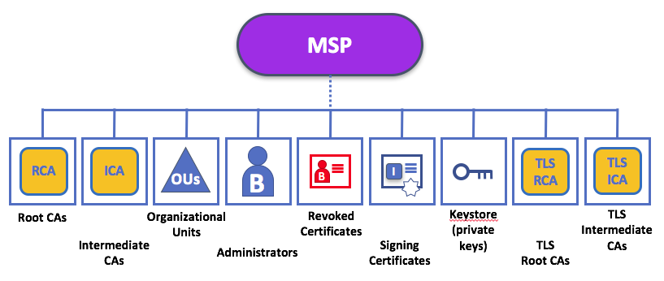

# Identity and Trusted Membership

Identities really matter in a Hyperledger Fabric blockchain network! That's because a principal's **identity determines the exact permissions over resources that they have in a blockchain network**. Most importantly, **a principal's identity must have two qualities** -- it must be **verified** (a real identity, in other words), and it must also come from a **trusted** source.

These two identity concepts -- verification and trust -- are provided by a **Public Key Infrastructure** (PKI) and a **Membership Service Provider** (MSP), respectively. A PKI is a set of existing internet standards which provide secure communications for many different types of networks, whereas an MSP is a Hyperledger Fabric concept for managing identities in a blockchain network. In combination, a PKI and an MSP form the definition of the **trusted members** of a blockchain network.

|  |
| :---: |
| Diagram required. |

Imagine that you visit a supermarket to buy some groceries. At the checkout you see a sign that says that only Visa, Mastercard and AMEX cards are accepted. If you try to pay with a different card -- let's call it an "ImagineCard" -- it doesn't matter whether the card is authentic and you have sufficient funds in your account. It will be not be accepted.

PKI and MSPs provide this combination of verification and trust. The PKI is like the card provider -- it dispenses verifiable identities. An MSP, on the other hand, is like the list of card providers accepted by the store -- determining which identities are the trusted members of the store payment network. **MSPs turn verifiable identities into the trusted members of a blockchain network**.

Let's drill into these concepts in a little more detail.

## What is PKI?

**A public key infrastructure (PKI) is a collection of internet technologies that provides secure communications in a network.** It's PKI that puts the **S** in **HTTPS** -- and if you're reading this documentation on a web browser, you're probably using a PKI to make sure it comes from a trusted source.

|  |
| :---: |
| Diagram required. |

Although a blockchain network is more than a simple communications network, it makes sense for it to use the PKI standard as much as possible. You'll see that even though PKIs aren't sufficient for all the needs of a blockchain network, it's still the fundamental basis of blockchain security. It's therefore really helpful if you understand the basics of PKI, and then why MSPs are so important.

There are four key elements to PKI:

 * **Digital Certificates**
 * **Public and Private Keys**
 * **Certificate Authorities**
 * **Certificate Revocation Lists**

Let's quickly describe these PKI basics, and if you want to know more details, then you can extend your knowledge [here](./https://en.wikipedia.org/wiki/Public_key_infrastructure).

## Digital Certificates

A digital certificate is a document which holds a set of attributes relating to a principal's identity. And the most common type of certificate is an [X.509 certificate](https://en.wikipedia.org/wiki/X.509), which allows the encoding of a principal's identifying details in its structure. For example, Mary Morris of Mitchell Cars in Detroit, Michigan might have a digital certificate with a `SUBJECT` attribute of `C=US, ST=Michigan, L=Detroit, O=Mitchell Cars, OU=Manufacturing, CN=Mary Morris/UID=123456`. This certificate is similar to a government identity card -- it provides  information about a particular individual when can be used by that individual to prove who they are. There are many other attributes in an X.509 certificate, but that's not important right now.

|  |
| :---: |
| Diagram required. |

What is important is that all of Mary's attributes can be written using a mathematical technique called crytography (literally *secret writing*) -- such that they cannot be tampered with without invalidating the certificate. Cryptography allows Mary to present her certificate to others to prove her identity, so long the other party trusts the certificate issuer, known as a **Certificate Authority** (CA). As long as the CA keeps certain cryptographic information securely (its **private key**), then anyone reading the certificate can be sure that the information about Mary has not been tampered with -- it will always have those particular attributes for Mary Morris. Think of Mary's X.509 certificate as her digital identity card that is impossible to change.

## Public Keys and Private Keys

There are two key elements to secure communication -- authentication and encryption.

**Authentication** ensures that anything that might relate to a principal's identity or information that has been generated has not been tampered with. For example, you might want to be sure you're communicating with the real Mary Mitchell rather than an impersonator.  Or if Mary has generated some information, you might want to be sure that it hasn't been changed by anyone else. In both cases, authenticity of information is of primary importance.

**Encryption**, on other hand, is quite different to authentication -- it enables the private transmission of information between Mary and other principals by ensuring that encrypted information can only be decrypted by its intended recipients and no one else.  

|  |
| :---: |
| Diagram required. |

**To enable authentication and encrypted communications**, a principal can use a pair of cryptographically related keys. **One of these keys is public and can be widely shared, while the other key is private, and absolutely must not be shared**. Finally, the keys have a unique mathematical relationship to each other such that the private key can be used to transform information that only the public key can interpret, and vice-versa.    

**This unique relationship between a public-private key pair is the cryptographic magic that makes secure communications possible**. For authentication, Mary uses her private key to create a small, unique data signature from an arbitrarily large amount of data which can only be verified by Mary's public key. For encryption, to allow messages to be encoded such that only Mary can decrypt then, Mary's public key can be used by anyone in a PKI to create a secret encoding of data that can only be transformed back to its original form by Mary's private key.

## Certificate Authorities

As you've seen, an identity is brought to the blockchain network by a principal in the form of a cryptographically validated digital certificate issued by a Certificate Authority (CA). CAs are a common part of internet security protocols, and you've probably heard of some of the more popular ones: Symantec (originally Verisign), GeoTrust, DigiCert, GoDaddy, and Comodo, among others.  

|  |
| :---: |
| Diagram required. |

The digital certificate provided by a CA for a principal incorporates the principal's public key as well as a comprehensive set of their attributes. Crucially, CAs themselves also have a certificate, which they make widely available. This allows the consumers of identities issued by a given CA to verify them by checking that the certificate could only have been generated by the holder of the corresponding private key (the CA). Because every principal who wants to interact with a blockchain needs an identity, you might say that **a CA defines an organization's principals from a digital perspective**. It's the CA that provides the basis for an organization's principals to have a verifiable identity, expressed as a digital certificate.

If you're interested, you can read a lot more about CAs [here](./), but for now you should think of them as the system actors who issue digital certificates that convey a principal's identity.

### Root CAs, Intermediate CAs and Chains of Trust

CAs come in two flavors: **Root CAs** and **Intermediate CAs**. Because Root CAs (Symantec, Geotrust, etc) have to **securely distribute** hundreds of millions of certificates to internet users, it makes sense to spread this process out across what are called *Intermediate CAs*. These Intermediate CAs provide their certificates under the authority of the Root CA, and this linkage between a Root CA and Intermediate CAs establishes a **Chain of Trust** for any certificate that is issued by any CA in the chain. This ability to track back to the Root CA not only allows the function of CAs to scale while still providing security -- allowing organizations that consume certificates to use Intermediate CAs with confidence -- it limits the exposure of the Root CA, which, if compromised, would destroy the entire chain of trust. If an Intermediate CA is compromised, on the other hand, there is a much smaller exposure.

|  |
| :---: |
| A chain of trust is established between a Root CA and a set of Intermediate CAs using a simple chain. Many other configurations are possible to meet the needs of collaborating organizations. |

Intermediate CAs provide a huge amount of flexibility when it comes to the issuance of certificates across multiple organizations, and that's very helpful in a permissioned blockchain system. For example, you'll see that different organizations may use different Root CAs, or the same Root CA with different Intermediate CAs -- it really does depend on the needs of the network.

### Fabric CA

It's because CAs are so important that Hyperledger Fabric provides a built-in CA component to allow you to create CAs in the blockchain networks you form. You don't have to use the Fabric CA, but you will find it very helpful when you're starting to build a blockchain network for the first time, or using the [DRIVENET sample network](./).  

A Fabric CA is not as sophisticated as a full CA, but that's OK -- it's sufficient for many purposes. As you'll see, there are a few limitations to a Fabric CA. You can read more about these restrictions in the [Fabric CA reference section](../ReferenceMaterial/FabricCA.md)

## Certificate Revocation Lists

|  |
| :---: |
| Diagram required. |

TBC

## Membership Service Provider

You've now seen how a PKI can provide verifiable identities through a chain of trust, so let's now see how these identities can be used to represent the trusted members of a blockchain network. That's where a Membership Service Provider (MSP) comes into play -- **it lists the identities of the principals who are the trusted members of a given organization in the blockchain network**.

Whereas a PKI provides a verifiable identity, an MSP complements this by identifying which Root CAs and Intermediate CAs are trusted to define which principals are considered the members of an organization.  An MSP can also recognize other things related to membership of a network -- a list identities that have been revoked, for example -- but those things will be covered later. For now, **think of an MSP as providing a list of members of a given organization**, either by holding certificates themselves or by listing which CAs can issue valid certificates, or -- as will usually be the case -- through some combination of both.

If an MSP is defined either on the local file system of a peer or orderer node, it is a **Local MSP**. If it's found in the policy configuration of the network or each channel, it is a **Global MSP**. You'll hear more about local and global MSPs and why the distinction between them is important later.

### Mapping MSPs to Organizations

Because an organization will typically have a single list of members, it will usually have a single MSP. This exclusive relationship makes it sensible to name the MSP after the organization, a convention you'll find adopted in most policy configurations. For example, organization `ORG1` would have an MSP called `ORG1.MSP`. In some cases an organization may require multiple membership lists -- for example, where channels are used to perform very different business functions with other organizations. In these cases it makes sense to have multiple MSPs and name them accordingly, e.g., `ORG2.MSP.NATIONAL` and `ORG2.MSP.GOVERNMENT`, reflecting the different membership roots of trust within `ORG2` in the NATIONAL sales channel compared to the GOVERNMENT channel.

|  |
| :---: |
| Two different MSP configurations for an organization. The first configuration shows the typical MSP relationship -- a single MSP defines the list of verifiable members of an organization. In the second configuration, different MSPs are used to support different identity providers for national, international, and governmental memberships.|

#### <a name="OUMSP"> Organizational Units and MSPs

An organization is often divided up into multiple **organizational units** (OUs), each of which has a certain set of responsibilities. For example, the `MITCHELL` organization might have both `MITCHELL.MANUFACTURING` and `MITCHELL.DISTRIBUTION` OUs to reflect these separate lines of business. When a CA issues X.509 certificates, the `OU` field in the certificate specifies the line of business to which the identity belongs.

We'll see later how OUs can be helpful to control the parts of an organization who are considered to be the members of a blockchain network. For example, in DRIVENET, only identities from the `MITCHELL.MANUFACTURING` OU might be able to access a channel, whereas `MITCHELL.DISTRIBUTION` cannot.

Finally, though this is a slight mis-use of OUs, they can sometimes be used by *different* organizations in a consortium to identify each other. In such cases, the different organizations use the same Root CAs and Intermediate CAs for their chain of trust, but assign the `OU` field appropriately to identify membership of each organization. We'll also see how to configure MSPs to achieve this later.

### Local and Global MSPs

There are two different types of MSPs: local and global. **Local MSPs are only defined for nodes** (peer or orderer) and they apply to the node where they are defined. **Every node must have a local MSP defined**.

In contrast, **global MSPs are defined either for channels or the entire network**, and they apply to all of the nodes that are part of a channel or network. Every channel or network must have at least one MSP defined for it, and peers and orderers on a channel will all share the same global MSP. The key difference here between local and global MSPs is not how they function, but their **scope**.  

|  |
| :---: |
| Local and Global MSPs. The MSPs for the peers are local, whereas the MSPs for the channel are global. Each peer is managed by its own organization, ORG1 or ORG2. This channel is managed by both ORG1 and ORG2. Similar principles apply for the network and orderers, but these are not shown here for simplicity. |

You can see that **local MSPs are only defined on the file system of the node** to which they apply. Therefore, physically and logically there is only one local MSP per node. However, as **global MSPs apply to all nodes in a channel or network**, they are logically defined once for the network or the channel. However, **a global MSP is instantiated on the file system of every node and kept synchronized via consensus**. So while there is a copy of a global MSP on the local file system of every node, logically the global MSP exists on the channel or the network.

You may find it helpful to see how local and global MSPs are used by seeing what happens when a blockchain administrator installs and instantiates a smart contract, as shown in the [diagram above](MSP2).

An administrator `B` connects to the peer with an identity issued by `RCA1`. When `B` tries to install a smart contract on the peer, the peer checks its **local MSP**, `ORG1.MSP`, to verify that the identity is indeed a member of `ORG1`. A successful verification will allow the install command to complete successfully. Subsequently, `B` wishes to instantiate the smart contract on the channel. Because this is a channel operation, all organizations in the channel must agree to it. Therefore, the peer must check the **global MSP** in the channel policy before it can successfully complete this command.  (Other things must happen too, but ignore those for now.)

You can see that the channel and the ledger are really **logical constructs** when they are defined at the channel level. It is **only when they are instantiated on a peer's local filesystem and managed by it that they become physical**. It's really important to understand how concepts like global MSPs, channel policies and even the ledger itself are **defined at the channel level, but instantiated and managed on the peers** of the different organizations in the channel.

### MSP Levels

The split between **global and local MSPs reflects the needs of organizations to administer their local resources**, such as a peer or orderer nodes, **and their global resources**, such as ledgers, smart contracts and consortia, which operate at the channel or network level. It's helpful to think of these MSPs as being at different **levels**, with **MSPs at a higher level relating to network-wide administration concerns** while **MSPs at a lower level handle identity for the administration of private resources**. This tiering is helpful because it supports the mix of both broad and narrow administrative control depending on how the network needs to be constituted. MSPs are mandatory at every level of administration -- they must be defined for the network, channel, peer and orderer.

|  |
| :---: |
| MSP Levels. The MSPs for the peer and orderer are local, whereas the MSPs for the channel and network are global. Here, the network is administered by ORG1, but the channel can be managed by ORG1 and ORG2. The peer is managed by ORG2, whereas ORG1 manages the orderer. ORG1 trusts identities from RCA1, whereas ORG2 trusts identities from RCA2. Note that these are **administration** identities, reflecting who can admininster these components. So while ORG1 administers the network, ORG2.MSP does exist in the network definition. |

 * **Network MSP:** These MSPs are defined in the configuration policy of the whole network, so by definition, **there is only one set of network MSPs**. Every principal who uses a network must be a trusted member as defined by the MSPs in the network policy before they can perform an administrative task. This means that the MSPs that are defined for the network should define **the organizations who are trusted to have administrative control over the network**. An example of a network-wide administrative permission might be to define or change the organizations who can create channels.

 * **Channel MSP:** These MSPs are defined inside the configuration policy of each channel, and therefore there is one set of MSPs for each channel that is defined. It is helpful for a channel to have its own set of MSPs because a channel provides private communications between a particular set of organizations which in turn have administrative control over it. You can see that the need for **a separate set of channel MSPs stems from the need for local autonomy** -- the organizations in a channel can, and will often need to be, largely independent from the rest of the network. It also means that administrative control over the network doesn't necessarily imply control over any particular channel; again reflecting the real administrative needs of collaborating organizations who may sometimes require separation of control. We see this kind of separation at the levels of control in the real world, too. The authority of the President of the United States, for example, exists at the federal level. He or she has no authority to veto state laws.

 * **Peer MSP:** This local MSP is defined on the file system of each peer. Conceptually, it performs exactly the same function as global MSPs with the restriction that it only applies to the peer where it is defined. As peers are owned by a particular organization and connect applications from that organization to the ledger, there is only a single MSP for a peer. It's possible to specify multiple different CAs in this MSP, but in practice a local MSP will usually refer to many fewer CAs than a set of global MSPs. An example of a peer permission might be the ability to install or upgrade smart contract chaincode on that peer.

 * **Orderer MSP:** Like a peer MSP, an orderer local MSP is also defined on the file system of the node and only applies to that node. Like peer nodes, orderers are also owned by a single organization and therefore have a single MSP to list its trusted principals, though again it's possible to specify multiple Root CAs. There are a currently very few, if any, administrative actions that are local to an orderer node, so in reality an orderer may not need to populate its local MSP.

### MSP Structure

So far, you've seen that the two most important elements of an MSP are the identification of the root and intermediate CAs that are used to used to establish a principal's trusted membership of an organization. There are,  however, more elements that are used in conjunction with these two to assist with membership functions.

|  |
| :---: |
| The figure above shows how a **local MSP** is stored on a local filesystem. Even though global MSPs are not physically structured in exactly the same way, it's still helpful to think about global MSPs this way. |

As you can see, there are nine elements to an MSP. You'll find it easy to understand if you think of these elements in a directory structure, where the MSP name is the root folder name with each subfolders representing different elements of an MSP.

Let's describe these folders in a little more detail and see why they are important.

 * **Root CAs**

 This folder contains a list of self-signed X.509 certificates of the Root CAs trusted by this organization. There must be at least one Root CA X.509 certificate in this MSP folder.

 This is the most important folder because it identifies the CAs from which all other certificates must be derived to be considered members of this organization.

 * **Intermediate CAs**

 This folder contains a list of X.509 certificates of the Intermediate CAs trusted by this organization. Each certificate must be signed by one of the Root CAs in the MSP or by an Intermediate CA -- or a chain of ICAs -- that ultimately lead back to a trusted Root CA. There do not need any Intermediate CA X.509 certificates in this MSP folder -- they are optional.

 Like the Root CA folder, this folder defines the CAs from which certificates must be issued to be considered members of the organization.  It's slightly less important than the Root CA folder, because it's not the root of trusted membership.

 * **Organizational Units**

 This folder contains a list of organizational units that are considered to be part of the MSP. It is is useful to use this folder when you want to restrict membership of principals to be from a part of a particular organization, which will be the case when an organization has a rich structure, [as discussed earlier](#OUMSP). You can see [how to configure the list of trusted OUs](../ReferenceMaterial/MembershipServicesProvider.md) in the reference material.

 Specifying OUs is optional. If no OUs are listed all of the principals that are part of an MSP, as identified by the Root CA and Intermediate CA folders, will be considered members of the organization.

 * **Administrators**

 This folder contains a list of X.509 certificates that define the principals who have the role of administrators of this organization. Typically there should be one or more certificates in this list.  

 It's worth noting that just because a principal has the role of an administrator it doesn't mean that they can administer particular resources! This seems strange, but will make more sense after you learn about the nature of policy permissions and how those permissions -- and not a principal's "role" -- are what define what any given organization's administrators can actually do. For example, a channel policy might specify that `MITCHELL.MANUFACTURING` administrators have the rights to add new organizations to the channel, whereas the `MITCHELL.DISTRIBUTION` administrators have no such rights. You can read more about policies [here](../PoliciesforAccessControl.md).

 It's worth noting that even though an X.509 certificate has a `ROLE` attribute (specifying, for example, that a principal is an "admin"), this refers to a principal's role within its organization rather than on the blockchain network. This is distinctly different from the purpose of the `OU` attribute, which -- if it has been defined -- refers to a principal's place in the network. Indeed, this is why we need the Administrators folder - because the blockchain role is quite different to the X.509 `ROLE`.

 The `ROLE` attribute **can** be used to confer administrative rights ls
 at the channel level if the policy for that channel has been written to allow any administrator from an organization (or certain organizations) permission to perform certain channel functions (such as instantiating chaincode). In this way **an organizational role can confer a network role**. We'll learn more about how policies can be written that way and how this functionality imparts significant operational advantages later.

 * **Revoked Certificates**

 If the X.509 certificate of a principal has been revoked, a copy of that certificate is stored in this folder -- a subfolder for each CA contains the revoked certificates for that CA.

 This list is conceptually the same as a CA's Certificate Revocation List (CRL), but relates to revocation of membership from the organization rather than revocation from the CA. As a result, the administrator of an MSP, local or global, can quickly revoke a principal from an organization without having to resort to revoking their certificate from a CA -- which, of course, might not be appropriate.

 This "list of lists" is optional. It will only become populated as certificates are revoked.

 * **Signing Certificate**

 This folder is typically defined for the local MSP of a peer or orderer node and contains the **public X.509 certificate** used by a node when it needs to identify itself to another principal in the network. This is the certificate a peer places in a transaction proposal, for example, to indicate that a peer's organization has endorsed it -- which can subsequently be checked against an endorsement policy (which will contain copies of approved public certificates) by a validating node.

 This folder is mandatory, and there must be exactly one X.509 certificate for the node.

 * **KeyStore for Private Key**

 This folder is typically defined for the local MSP of a peer or orderer node and contains the **private key** to be used by that node. This key is used by a node when it needs to sign or encrypt data -- for example to sign a transaction proposal, indicating that a peer's organization has endorsed it.

 This folder is mandatory, and there must be exactly one private key for the node. Obviously, access to this folder must be limited only to those operators administrators who have responsibility for the local MSP's peer or orderer node.

 * **TLS Root CA**

 This folder contains a list of self-signed X.509 certificates of the Root CAs trusted by this organization **for TLS communications**. An example of a TLS communication would be when a peer needs to connect to an orderer so that it can receive ledger updates.

 This folder is completely independent to the MSP Root CA folder. This separation allows peer and order nodes to have different membership to the other principals in the network -- applications or administrators. This makes sense when you think about it -- users and applications are very likely to have different roots of trust than the peer and orderer nodes which form the network.

 There must be at least one TLS Root CA X.509 certificate in this MSP folder.

 * **TLS Intermediate CA**

 This folder contains a list of X.509 certificates of the Intermediate CAs trusted by this organization **for TLS communications**.

 By analogy to the TLS Root CA folder, this folder is kept separate to the MSP Intermediate CA folder for the same reason. There do not need any Intermediate CA X.509 certificates in this MSP folder -- they are optional.

## MSPs in DRIVENET

*This section still needs some work*

Root of Trust established -- or used, more likely -- by Mitchell and Regal (and the two dealerships, possibly). Could be that the entire car industry uses -- for convenience sake -- the same root of trust.

Will ZBS use the same root of trust as Mitchell and Regal? Possibly.

The DMV wouldn't, which means that either the initial configuration would have to recognize its CA or there'd have to be a config transaction to update the network definition to include it. *That's my read of it anyway.*  

## That's it!

OK, we've now finished our extensive tour of identities and trusted membership of a blockchain network!

In summary, Hyperledger Fabric uses a PKI and MSPs to identify the principals who are the trusted members of each organization collaborating in a blockchain network.

[Next: Policies for Access Control](./PoliciesforAccessControl.md)
