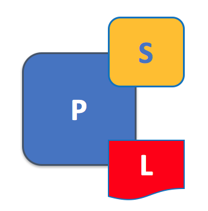

# Peers

As you've seen, **the two most important concepts in a blockchain network are ledgers and smart contracts**.  That's because smart contracts and ledgers are used to encapsulate the shared processes and shared information in the business network, respectively. When a developer writes a blockchain application, the ledgers and smart contracts allows network participant to provide or consume the services of others in the network.

For example, in DRIVENET, smart contracts correspond to the manufacture, distribution, sale, insurance, and other transactions in a car's lifecycle. The result of these transactions are captured as updates to ledgers which are shared between Mitchell, Regal, Cecil, ZBS insurance and the other organizations that use the blockchain network. The different participants in the business network write applications that allow them to provide their specific value to the DRIVENET network.

An now you can see that peers are important for two reasons.  **Firstly, peers form the blockchain network**. Yes, there are other components to a blockchain network such as orderers and permission policies, but without peers there cannot be any kind of meaningful blockchain network.  That's because of the next reason, which is arguably more important. **Secondly, peers are where the ledger and smart contract physically reside in the blockchain network.**

So let's now turn our attention the peer.

## Peers form the blockchain network

A blockchain network is comprised of many nodes. Through their connectedness, nodes give the network its structure -- and we'll look at that connected structure in more detail later. For now, its enough to know that there are two types of nodes, called peers and orderers. It's natural to think of the peer as the most important type of node, because **a peer holds both a copy of a ledger, and a copy of a smart contract.**

|  |
| :---: |
| An example blockchain network formed by three peers. A blockchain is primarily formed from peer nodes, each of which can hold copies of a ledger and smart contracts. In this example, each peer holds a copy of the same ledger and smart contracts -- though this is not usually the case.|

In a very real sense, we see that the network is formed from the peer nodes that host ledgers and smart contracts. You'll see that peers are the primary objects that administrators manage on a day-to-day basis using the `peer` command. Peers are created, started, stopped, reconfigured, and even deleted. Technically, a blockchain network can exist without any peers being defined, but for all practical purposes, peers are what *make* a blockchain network real.

Peers can have connections to other peer nodes, as well as orderer nodes, and we'll cover this later in this topic, and more in the [network topic](./).

Finally, you might find it helpful to note that there is not a *blockchain network* object in the same way that there's a peer object. Rather, the network comes into existence when certain other objects are defined, such as policies, orderers, MSPs, or peers.  And practically speaking, until there are peers, a blockchain network cannot do anything meaningful. Mostly, the network is administered by configuring these other objects, rather than any separate object called a 'network'.

## Peers host smart contracts and ledgers

A peer is a *host* for smart contracts and ledgers - it's where smart contracts and the ledger *live*, in a physical sense. If a network participant wants to provide or consume smart contracts and ledgers then they interact with a peer, because that's where smart contracts and ledgers reside.  

|  |
| :---: |
| A Peer hosts ledgers and smart contracts. There can be many smart contracts hosted on a peer for a ledger.  |

There's a great deal of flexibility in terms the number of ledgers and smart contracts on a peer.  For example, can host zero or more ledgers, and a peer can host zero or more smart contracts.  Typically, there will be many more smart contracts than there will be ledgers -- this makes sense because a ledger is the base for the provision of services, expressed as smart contracts.

|  |
| :---: |
| Peers hosting different numbers of ledgers and smart contracts. Peers have one or more ledgers, and each ledger has zero or more smart contracts that apply to them.  Moreover, some smart contracts may apply to multiple ledgers.  |

When considering ledgers, a peer hosts one or more instances of a ledger.  It is common for peers to only have a copy of the ledger and no smart contracts.  Such peers are monitoring ledger updates, as might be typical of a regulator.  For example, in the DRIVENET network, the DMV only wants to monitor the production of cars by Regal and Mitchell - it does not want to control it.  This is the primary use of ledgers without smart contracts.  

When considering smart contracts, typically there are multiple smart contracts for a ledger. For example, in DRIVENET, Regal and Mitchell provide smart contracts for the manufacture of their cars.  They could chose to use the same smart contract, but regardless their smart contracts will update the same ledger.  

You can also see that the same smart contract can run on different ledgers.  For example in DRIVENET, ZBS insurance wants to provide services to Cecil's who supply both the Mitchell and Regal cars, as well as Faster Autos, who only sell Regal cars.  Even though these ledgers are kept quite separate, ZBS can use the same smart contract to provide insurance services to these private channels.

## Peer Container  

When a peer does host smart contracts.

Moreover a peer can host multiple smart contracts for the same ledger, because different smart contracts can encapsulate different

That's not the whole story, however, because these different *physical* copies of the ledger need to be kept synchronized with each other, so that they can be considered to be the same *logical* ledger. This is achieved by a process called consensus -- which keeps the individual physical ledgers in step with each other. We'll discuss the logical/physical nature of the ledger and smart contracts later, as well as how peers take part in the consensus mechanism. First let's understand a little more about individual peers.

## Peers and decentralization

**Peers are what makes a blockchain a distributed ledger**, because a network comprises many peers, and it's these peers which hold a copy of the ledger and the smart contracts which interact with it.

## Applications and peers

|  |
| :---: |
| Peers in a Hyperledger Fabric blockchain network. An application interacts with the smart contracts and ledgers in a blockchain network by communicating with a one or more peers on a particular channel. Smart contracts can be used to query or update the ledger. |

|  |
| :---: |
| Applications connect to peers to invoke smart contracts which query or update the ledger. Queries are returned  |

## Organizations and peers

## Channels and Peers

## The services provided by a peer

### Material to be incorporated

## Applications and peers

The peers in a Fabric network function both as **providers** of services to the network and as **consumers** of those services. A rough analogy might be to a co-op -- a grocery store where the people who shop there are also the stockers and cashiers.

This combination of tasks and responsibilities makes the exact "role" of a peer somewhat difficult to pin down -- it has, as a practical matter, **many** roles. Consider that in the course of a transaction flow, a peer might be involved in all of the following:

  1. Proposing the transaction (either directly through its own application or as a medium for an outside application using the peer as an access point to the network).
  2. Checking the endorsement policy for the transaction to make sure the correct number -- or a particular set of peers specified in the endorsement policy -- have signed the transaction.
  3. Executing a version check of the ledger (held by the peers on a channel -- more on this later) to make sure that there have been no other transactions written to the ledger since the proposal was made.
  4. Receiving the transaction response from the ordering service.
  5. Writing the transaction to its ledger (assuming all goes well).  

Peers are owned and controlled by consortia members. Each member organization can have one peer or several, depending on its needs. Within an organization, one peer must be specified as the **Leading Peer**. It is this peer that interacts with the network at large and disseminates ordered transactions to the other peers in its organization. If this peer goes down, another peer within that organization will take over its role until the leading peer is back functioning. For the purpose of communication between organizations using gossip, an **Anchor Peer** is also specified. This peer will often but not necessarily be the same peer as the leading peer. We'll talk more about gossip later.

## Peers and the Ledger

Ledgers are stored on a peer's file system (either locally or externally depending on the type of database the peer is using). Peers will have a separate ledger for every channel they're a member of.

Link here to TheLedger.md.

## Peers and Identity

Local MSP (at the peer level). Who is allowed to do what on that peer? The peer will have the same MSP as its organization (since peers belong to organizations). Will go back to the RCA of the ORG. This org msp structure is what allows intraorganizational gossip and the function of the leading/anchor peers.

Peers will also maintain Global MSP for every channel they're a part of. Regulates permissions on those channels. Peers may be a part of many channels and will maintain a Global MSP for each channel.

Sign certs.

Also, at the channel level -- what are admins for that peer allowed to do on the channel (instantiate chaincode, for example -- implicit metapolicies)?

## Starting and Stopping Peers

The state database will automatically get recovered (or generated if needed) upon peer startup, before transactions are accepted.

## Joining a Channel

Get the ledger from the Leading Peer. Or, if there's no Leading Peer, from the orderer. It could also be gotten from another Anchor Peer in a channel, but this is not a best practice.

Difference between being added to a channel that's already running and being part of the founding of a channel. If peer is part of the creation of a channel, it's ORG MSP will be part of the initial config block of the channel. If peer is being added to a channel that doesn't recognize its ORG MSP, the MSP of that ORG must be added by the admins of the channel.

Specify that even if ORG1 and ORG2 use the same RCA -- Verisign, for example -- the specific ORG MSP must be added to the channel first (since peers must be tied to an organization). *I think that's right, anyway*.

## Changing a Peer

All of the components in a Fabric network have a version.

What are the configurations of a peer that are optional (ie **can** be updated)? Admin policy.

## Gossip

Peers leverage gossip to broadcast ledger and channel data in a scalable fashion. Gossip messaging is continuous, and each peer on a channel is constantly receiving current and consistent ledger data from multiple peers. Each gossiped message is signed, thereby allowing Byzantine participants sending faked messages to be easily identified and the distribution of the message(s) to unwanted targets to be prevented. Peers affected by delays, network partitions or other causations resulting in missed blocks, will eventually be synced up to the current ledger state by contacting peers in possession of these missing blocks.

The gossip-based data dissemination protocol performs three primary functions on a Hyperledger Fabric network:

    1. Manages peer discovery and channel membership, by continually identifying available member peers, and eventually detecting peers that have gone offline.
    2. Disseminates ledger data across all peers on a channel. Any peer with data that is out of sync with the rest of the channel identifies the missing blocks and syncs itself by copying the correct data.
    3. Bring newly connected peers up to speed by allowing peer-to-peer state transfer update of ledger data.

Gossip-based broadcasting operates by peers receiving messages from other peers on the channel, and then forwarding these messages to a number of randomly-selected peers on the channel, where this number is a configurable constant. Peers can also exercise a pull mechanism, rather than waiting for delivery of a message. This cycle repeats, with the result of channel membership, ledger and state information continually being kept current and in sync. For dissemination of new blocks, the leader peer on the channel pulls the data from the ordering service and initiates gossip dissemination to peers.

Online peers indicate their availability by continually broadcasting “alive” messages, with each containing the public key infrastructure (PKI) ID and the signature of the sender over the message. Peers maintain channel membership by collecting these alive messages; if no peer receives an alive message from a specific peer, this “dead” peer is eventually purged from channel membership. Because “alive” messages are cryptographically signed, malicious peers can never impersonate other peers, as they lack a signing key authorized by a root certificate authority (CA).

In addition to the automatic forwarding of received messages, a state reconciliation process synchronizes world state across peers on each channel. Each peer continually pulls blocks from other peers on the channel, in order to repair its own state if discrepancies are identified. Because fixed connectivity is not required to maintain gossip-based data dissemination, the process reliably provides data consistency and integrity to the shared ledger, including tolerance for node crashes.

## Peers in DRIVENET

Regal might choose to have two different peers to put on the two channels they're on (but they don't need to).

          + What is a peer?
          + Peers and the ledger
          + Peers and Identity
          + Starting and Stopping Peers
          + Joining a channel
          + Changing a Peer
          + Peers in DRIVENET

[Next: Chaincode](./Chaincode.md)
