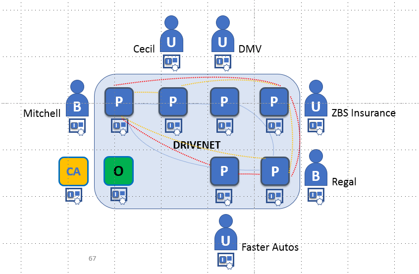

# The DRIVENET Sample Network

## Expanding DRIVENET

Mitchell and Regal will later expand DRIVENET to include ZBS Insurance, who will offer insurance plans to Cecil’s customers. Separately, Regal invites Faster Autos, from Miami, Florida, who only sells Regal cars – which it receives at a significantly reduced price – to the network. Faster Autos also wants to make ZBS insurance plans available to its customers and will – like Cecil’s – employ developers to write applications to manage their plans.

    + Inviting ZBS Insurance to DRIVENET
        + (Mitchell or Regal's) tasks
            + Defining a channel
            + Inviting Cecil and ZBS Insurance to the channel
            + Assigning rights to Cecil and ZBS Insurance
        + (Cecil) Joining the channel
        + (ZBS Insurance's) tasks
            + Joining DriveNet and the channel
            + Starting the orderer
    + (All organizations) Installing chaincode
    + (Any qualified organization) Instantiating chaincode

[-->Next](../AdminTasks/AdminTasks.md)
