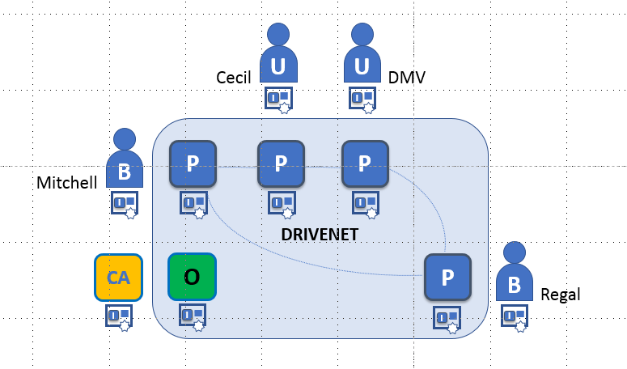

# The DRIVENET Sample Network

## Growing DRIVENET

After setting up the initial network, Mitchell and Regal will invite Cecil’s – a car dealership in Decatur, Illinois, who sells both types of cars – to DRIVENET. Mitchell and Regal are also required to invite the DMV to DRIVENET to ensure that cars are registered properly and that changes of ownership are recorded. These new parties will participate fully in the network, but with fewer administration rights. Developers at Cecil’s and the DMV write applications to sell cars and register their usage on DRIVENET.

    + Inviting Regal and DMV to DRIVENET
        + (Mitchell or Regal's) tasks
            + Defining a channel _[separate channels for Cecil and DMV?]_
            + Inviting Cecil and DMV
            + Assigning rights to Cecil and DMV
        + (Cecil and DMV's) tasks
            + Joining DRIVENET and the channel
            + Starting the orderer
    + (All organizations) Installing chaincode
    + (Any qualified organization) Instantiating chaincode

[-->Next](../DriveNetSample/ExpandingDRIVENET.md)
