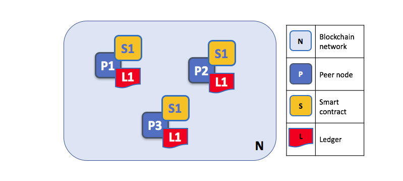
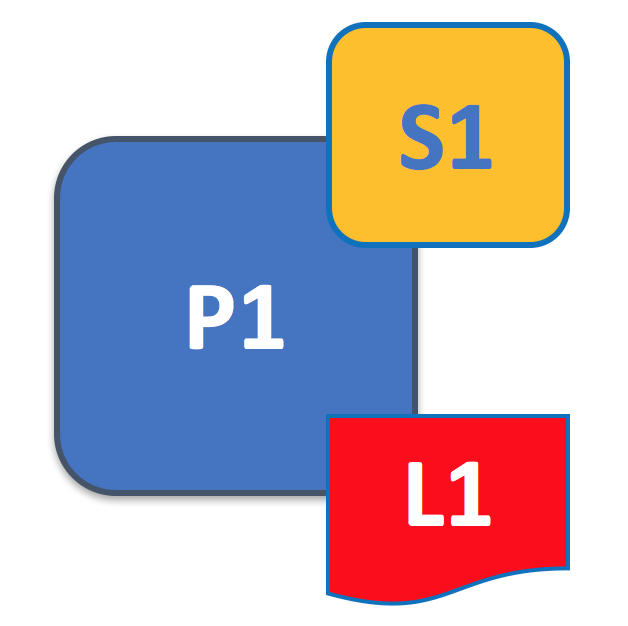
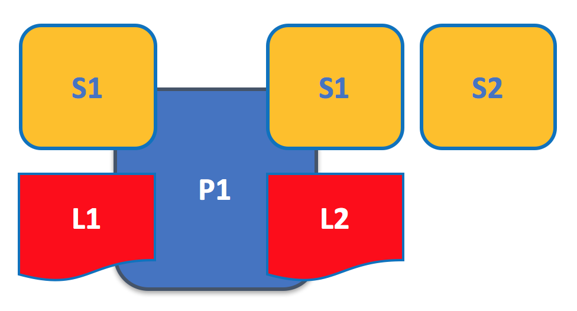
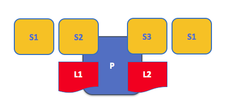
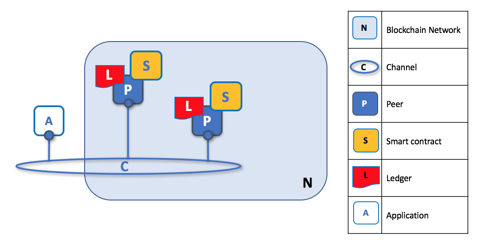
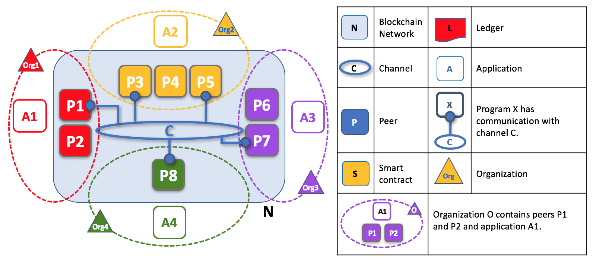

# Peers

As you've seen, **two of the most important concepts in a blockchain network are ledgers and smart contracts**. That's because smart contracts and ledgers are used to encapsulate the shared **information** and shared **processes** in the business network, respectively. When a developer writes a blockchain application, the ledgers and smart contracts allow a network participant to provide or consume services in the network.

What makes peers important is that **they are the place where ledgers and smart contracts physically reside**. Because of this, peers -- and their connections to other nodes (to peers and to orderer nodes) -- **are what actually form the physical structure of blockchain network**.

## Peers form the blockchain network

A blockchain network is formed by a set of peer nodes. Peers are the most important elements of the network because they host ledgers and smart contract chaincodes. Without peers, there cannot be a blockchain network, and they are the first physical concept to understand. Other elements are important, such as orderers, channels and policies -- you'll learn about these elsewhere, but you'll find it easiest to start with peers.

|  |
| :---: |
| An example blockchain network formed by three peers. A blockchain is primarily formed from peer nodes, each of which can hold copies of a ledger and smart contracts. In this example, each peer holds a copy of the same ledger and smart contracts. |

It's helpful to remember that the blockchain network only comes into existence when peers and certain other objects -- such as policies, orderers, and MSPs -- are defined. In other words, **blockchain networks are not actually objects in themselves**. The administration of a blockchain network, then, really amounts to the management of these objects, rather than any separate object called a "network".

**Peers are the primary objects that administrators manage on a day-to-day basis using the `peer` command**. They can be created, started, stopped, reconfigured, and even deleted. You'll see later how peers are represented as operating system processes to provide the functionality to application programs who wish to consume key services provided by a peer.

## Peers host smart contracts and ledgers

Let's look at a peer in a little more detail. We can see that it's the peer that hosts both the ledger and smart contracts. More accurately, the peer actually hosts *instances* of the ledger, and *instances* of smart contract chaincode.

|  |
| :---: |
| A Peer hosts ledgers and smart contracts. There can be many smart contracts hosted on a peer for a ledger.  |

Because a peer is a *host* for smart contracts and ledgers, if a network participant wants to provide or consume smart contracts and ledgers, they must interact with a peer. A network participant might be using an application, or might be an administrator -- but it's always the peer that provides the key services that allowing interactions with ledgers and smart contracts. That's why peers are often considered the most fundamental building blocks of a blockchain network.

## Hosting multiple ledgers

A peer is able to host more than one ledger, which is helpful because it allows for a very flexible system design. The simplest peer configuration is to have a single ledger, but it's absolutely appropriate for a peer to host two, three, or even more ledgers when required by the design. We'll see later how peers interact with the ledger, but for now, it's easiest to think of the ledger has being hosted on the peer.

|  |
| :---: |
| A peer hosting multiple ledgers. Peers host one or more ledgers, and each ledger has zero or more smart contracts that apply to them. In this example, we can see that the peer P hosts ledgers L1 and L2. L1 doesn't have any smart contracts which access it. L2 on the other hand has smart contracts S1 and S2 which access it. |

You can see that it's perfectly reasonable for a peer to host a ledger without hosting smart contracts which access it. This may be the case when an organization just requires a copy of the ledger without wanting to interact with it -- for back-up or disaster recovery purposes, for example. However, it's more typical that a peer has at least one smart contract installed on it so that it can query or update the ledger.

## Hosting multiple smart contracts

Typically, a peer will host many more smart contracts than ledgers.  Whereas there is a single ledger for each channel to which a peer is joined, there might be multiple smart contracts for every ledger hosted on a peer.  

|  |
| :---: |
| A peer hosting multiple smart contracts. Each ledger can have many smart contracts which access it. In this example, we can see that the peer P hosts ledgers L1 and L2. L1 is accessed by S1 and S2, whereas L2 is accessed by S3 and S1. We can see that S1 can access both L1 and L2. |

It's also usually the case that different smart contracts access different ledgers. That's because different ledgers usually have different data structures, although as you can see, if it's appropriate, one smart contract can access different ledgers. This is particularly useful if an organization in the network -- an insurance company, for example -- wants to be able to offer the same services to organizations on different channels.  

## Applications and peers

Applications connect to network peers when they need to access ledgers and smart contracts. The SDK makes this process easy for programs -- there are APIs to connect to ledgers, invoke smart contracts, and receive ledger notifications. Query responses are an immediate because they can be fulfilled from the local copy of the ledger. Updates take a little longer as they need to be agreed by other peers across the network.

|  |
| :---: |
| Applications connect to peers to execute smart transactions which access the ledger. Query transactions return immediately. For updates, the peer will notify the application after the update has been accepted by the wider network. |

When applications want to access the ledger for query or update, they connect to a peer and invoke a smart contract.  It's the smart contract which encapsulates all access to the ledger. The two major access patterns are ledger query or ledger update.

A query transaction can return its results immediately to the application because all the information required to satisfy the query is in the local copy of the ledger. Indeed, an application can connect to one or more peers in the network which hosts a copy of the ledger to issue a query, as each peer's copy of the ledger is kept up-to-date; though typically applications will connect to a single peer. It's interesting to note that for query transactions the peer does not need to consult with other peers in order to return the results to the application.

An update transaction is quite different, because a single peer cannot, on its own, update the ledger -- it requires the consent of other peers in the network. A peer requires other peers in the network to approve a ledger update before it can be applied to a peer's local ledger. This process is called *consensus* -- it is asynchronous in nature and therefore takes longer to complete than a query. But when all the peers required to approve the transaction do so, and the transaction is committed to the ledger, peers will notify their connected applications that the ledger has been updated.

Again, the SDK makes these two process easy for applications.  For query transactions, applications connect to peers, invoke a smart contract query transaction, and receive an immediate response.  For update transactions, it's only a little more complex; applications connect to peers, invoke a smart contract update transaction and receive an asynchronous notification when the ledger has been updated -- they do not need to worry about the mechanics of the consensus process.

## Peers and channels

Although this topic is about peers rather than channels, it's worth spending a little time understanding how peers interact with each other, and applications, via channels.

A channel is a mechanism by which a set of components within a blockchain network can communicate and transact privately. These components are typically peer nodes, orderer nodes, and applications, and by joining a channel they collectively share and manage identical copies of the ledger for that channel.  

|  |
| :---: |
| Peers connecting in a blockchain network via channels. Channels allow a specific set of peers and applications to communicate with each other within a blockchain network. In this example, we can see a channel which has two peers and an application joined to it within a blockchain network. Each peer hosts a copy of the ledger and a smart contract. For simplicity, an orderer node is not shown in this diagram, but one must be present in a functioning network.|

Within a blockchain network, it's helpful to think of different channels as being completely separated from each other. Although this isn't precisely true, it makes it easier to understand -- and we'll cover the exceptions later.

A blockchain network is typically built from multiple channels, and these channels are formed by the peers than join them. We see that channels don't exist in the same way that peers do -- it's more appropriate to think of a channel as a logical structure that is formed by a collection of physical peers. Because of this channels are actually accessed and managed via peers. **It is vital to understand this point -- peers provide the control point for access to, and management of, channels**.    

## Peers and organizations

Now that you understand peers and their relationship to ledgers, smart contracts and channels, you'll be able to see how multiple organizations come together to form a blockchain network.

As you may know, a blockchain is a *decentralized network*. This means that it is not owned by any one organization, but many -- and without these organizations, there cannot be a blockchain network.  Peers are central to how this kind of distributed network is built. It's because different peers are owned by different organizations, and then connected together using channels, that the network is formed and managed.

|  |
| :---: |
| Peers in a blockchain network with multiple organizations. The blockchain network is built up from the peers owned and contributed by the different organizations.  In this example, we see 4 organizations who contribute 8 peers to form a network. The channel C connects 5 of these peers in the network N -- P1, P3, P5, P7 and P8. The other peers have not joined this channel.  Applications from a particular organization usually connect to the peers owned by that application. Again, for simplicity, an orderer node is not shown in this diagram.|

It's really important that you can see what's happening in the formation of a blockchain network. **The network is both formed and managed by the multiple organizations who contribute peers.**  Multiple organizations are coming together the grow the network by donating resources to it. Therefore, the network does not exist in any meaningful sense unless and until organizations contribute resources.  You can see that there are no centralized resources -- in the [example above](#Peer8), the network, N, would not exist if Org1-Org4 did not contribute their peers.  **Moreover, the network does not depend on any individual organization -- it will continue to exist as long as one organization remains**, no matter which other organizations may come and go.  This is at the heart of what it means to be a decentralized network.

### An internet analogy

If you know a little (or a lot!) about how the internet is structured from routers, then you can compare how a Hyperledger Fabric blockchain is formed from peer nodes.  In the internet, anyone can add a router, thereby making the network bigger. An organization who contributes a router to the network, forms the network, and retains management over it for the benefit of all. The same thing is happening in a blockchain network - organizations add their peers to the network, thus increasing its size, while at the same time retaining ownership of it.  

Moreover, to extend the analogy, existing internet routers need to start routing IP packets to a newly added router. What's happening here is that the administrators of existing routers are acknowledging that the newly added router can handle internet traffic, and that they will likewise accept packets from it.  In the same way, a Hyperledger Fabric network has a network channel policy which defines which organizations can add peers which send and receive ledger updates - the traffic in a blockchain network. It's a little nicer in Hyperledger Fabric though -- as there is a policy which defines which organizations are allowed to contribute peers (and orderers) to a network -- it does not require administrator intervention on a peer by peer basis.

Analogies are never perfect of course -- the key point is decentralization -- multiple organizations come together to contribute resources, and agree between themselves how the network in managed.  The is not one organization that owns or controls the network, and even though this makes it a little more difficult to understand and manage, there are significant benefits in terms of resilience from a technical and business perspective.

### Review to this point

### Following material to be incorporated

## Peers and channel policy

## Peers and orderers

Short section discussing for peers.  Not main section.

Role of orderer as it relates to peers - to capture proposed updates (from app, not peers), and to distribute to back to ALL peers. Emphasize how peers, orderers work together.  

Difference between peers and orderers.  Do not hold ledger.  Purely technical role. Connected to all channels (don't major on this - that's for orderer topic). Brief mention of ordering org(s) - again, this is for orderer topic.

## Logical Network

You might have noticed that the example above does not show an orderer, but as you've seen, orderers -- like peers -- are not necessary to form a blockchain network on a logical level (just as the rules of the road can be written before there are highway interchanges).

The physical structure of the peers and orderers separates them from the logical framework of the policies that govern how peers and the orderer nodes interact. This is similar to how a *set of laws* -- the rules of driving, for example -- are different from the people, cars, and physical structures that actually make up the *highway system*.  

## Peer Container  

When a peer does host smart contracts.

Moreover a peer can host multiple smart contracts for the same ledger, because different smart contracts can encapsulate different

That's not the whole story, however, because these different *physical* copies of the ledger need to be kept synchronized with each other, so that they can be considered to be the same *logical* ledger. This is achieved by a process called consensus -- which keeps the individual physical ledgers in step with each other. We'll discuss the logical/physical nature of the ledger and smart contracts later, as well as how peers take part in the consensus mechanism. First let's understand a little more about individual peers.

## Peers and decentralization

**Peers are what makes a blockchain a distributed ledger**, because a network comprises many peers, and it's these peers which hold a copy of the ledger and the smart contracts which interact with it.

## The services provided by a peer

### Material to be incorporated

## Applications and peers

The peers in a Fabric network function both as **providers** of services to the network and as **consumers** of those services. A rough analogy might be to a co-op -- a grocery store where the people who shop there are also the stockers and cashiers.

This combination of tasks and responsibilities makes the exact "role" of a peer somewhat difficult to pin down -- it has, as a practical matter, **many** roles. Consider that in the course of a transaction flow, a peer might be involved in all of the following:

  1. Proposing the transaction (either directly through its own application or as a medium for an outside application using the peer as an access point to the network).
  2. Checking the endorsement policy for the transaction to make sure the correct number -- or a particular set of peers specified in the endorsement policy -- have signed the transaction.
  3. Executing a version check of the ledger (held by the peers on a channel -- more on this later) to make sure that there have been no other transactions written to the ledger since the proposal was made.
  4. Receiving the transaction response from the ordering service.
  5. Writing the transaction to its ledger (assuming all goes well).  

Peers are owned and controlled by consortia members. Each member organization can have one peer or several, depending on its needs. Within an organization, one peer must be specified as the **Leading Peer**. It is this peer that interacts with the network at large and disseminates ordered transactions to the other peers in its organization. If this peer goes down, another peer within that organization will take over its role until the leading peer is back functioning. For the purpose of communication between organizations using gossip, an **Anchor Peer** is also specified. This peer will often but not necessarily be the same peer as the leading peer. We'll talk more about gossip later.

## Peers and the Ledger

Ledgers are stored on a peer's file system (either locally or externally depending on the type of database the peer is using). Peers will have a separate ledger for every channel they're a member of.

Link here to TheLedger.md.

## Peers and Identity

Local MSP (at the peer level). Who is allowed to do what on that peer? The peer will have the same MSP as its organization (since peers belong to organizations). Will go back to the RCA of the ORG. This org msp structure is what allows intraorganizational gossip and the function of the leading/anchor peers.

Peers will also maintain Global MSP for every channel they're a part of. Regulates permissions on those channels. Peers may be a part of many channels and will maintain a Global MSP for each channel.

Sign certs.

Also, at the channel level -- what are admins for that peer allowed to do on the channel (instantiate chaincode, for example -- implicit metapolicies)?

## Starting and Stopping Peers

The state database will automatically get recovered (or generated if needed) upon peer startup, before transactions are accepted.

## Joining a Channel

Get the ledger from the Leading Peer. Or, if there's no Leading Peer, from the orderer. It could also be gotten from another Anchor Peer in a channel, but this is not a best practice.

Difference between being added to a channel that's already running and being part of the founding of a channel. If peer is part of the creation of a channel, it's ORG MSP will be part of the initial config block of the channel. If peer is being added to a channel that doesn't recognize its ORG MSP, the MSP of that ORG must be added by the admins of the channel.

Specify that even if ORG1 and ORG2 use the same RCA -- Verisign, for example -- the specific ORG MSP must be added to the channel first (since peers must be tied to an organization). *I think that's right, anyway*.

## Changing a Peer

All of the components in a Fabric network have a version.

What are the configurations of a peer that are optional (ie **can** be updated)? Admin policy.

## Gossip

Peers leverage gossip to broadcast ledger and channel data in a scalable fashion. Gossip messaging is continuous, and each peer on a channel is constantly receiving current and consistent ledger data from multiple peers. Each gossiped message is signed, thereby allowing Byzantine participants sending faked messages to be easily identified and the distribution of the message(s) to unwanted targets to be prevented. Peers affected by delays, network partitions or other causations resulting in missed blocks, will eventually be synced up to the current ledger state by contacting peers in possession of these missing blocks.

The gossip-based data dissemination protocol performs three primary functions on a Hyperledger Fabric network:

    1. Manages peer discovery and channel membership, by continually identifying available member peers, and eventually detecting peers that have gone offline.
    2. Disseminates ledger data across all peers on a channel. Any peer with data that is out of sync with the rest of the channel identifies the missing blocks and syncs itself by copying the correct data.
    3. Bring newly connected peers up to speed by allowing peer-to-peer state transfer update of ledger data.

Gossip-based broadcasting operates by peers receiving messages from other peers on the channel, and then forwarding these messages to a number of randomly-selected peers on the channel, where this number is a configurable constant. Peers can also exercise a pull mechanism, rather than waiting for delivery of a message. This cycle repeats, with the result of channel membership, ledger and state information continually being kept current and in sync. For dissemination of new blocks, the leader peer on the channel pulls the data from the ordering service and initiates gossip dissemination to peers.

Online peers indicate their availability by continually broadcasting “alive” messages, with each containing the public key infrastructure (PKI) ID and the signature of the sender over the message. Peers maintain channel membership by collecting these alive messages; if no peer receives an alive message from a specific peer, this “dead” peer is eventually purged from channel membership. Because “alive” messages are cryptographically signed, malicious peers can never impersonate other peers, as they lack a signing key authorized by a root certificate authority (CA).

In addition to the automatic forwarding of received messages, a state reconciliation process synchronizes world state across peers on each channel. Each peer continually pulls blocks from other peers on the channel, in order to repair its own state if discrepancies are identified. Because fixed connectivity is not required to maintain gossip-based data dissemination, the process reliably provides data consistency and integrity to the shared ledger, including tolerance for node crashes.

## Peers in DRIVENET

Regal might choose to have two different peers to put on the two channels they're on (but they don't need to).

          + What is a peer?
          + Peers and the ledger
          + Peers and Identity
          + Starting and Stopping Peers
          + Joining a channel
          + Changing a Peer
          + Peers in DRIVENET

[Next: Chaincode](./Chaincode.md)
