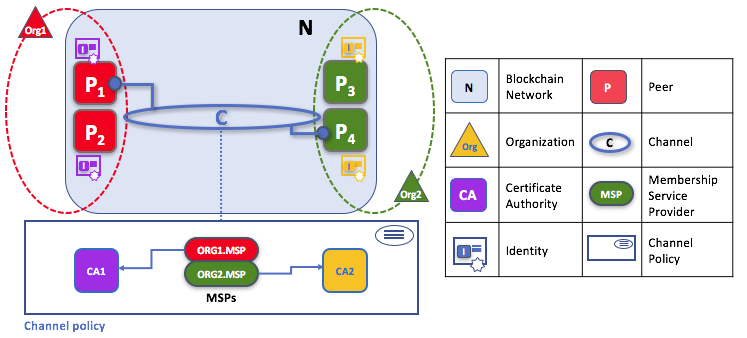
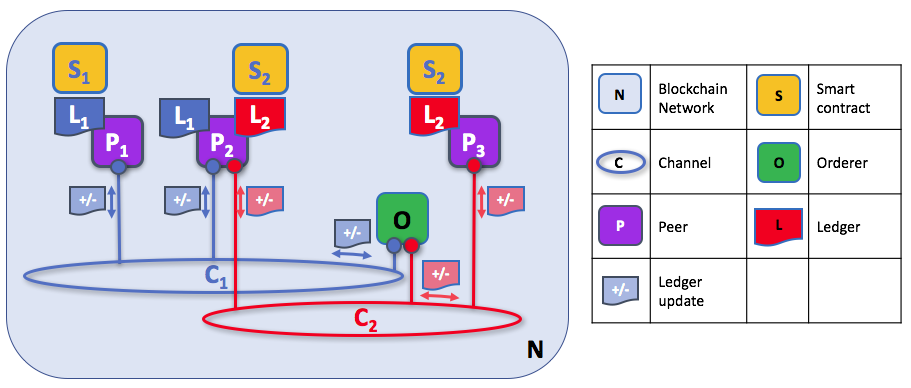
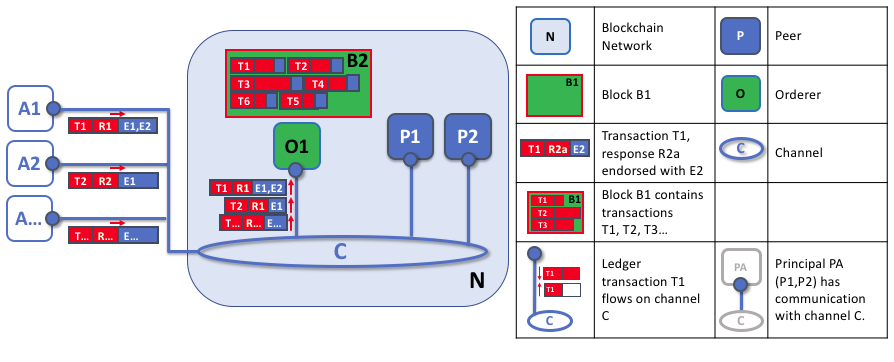
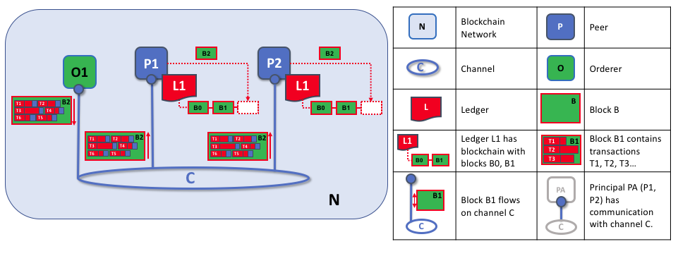

# Peers

**The two of the most important concepts in a blockchain network are ledgers and smart contracts**. Recall that a ledger is like a file or database store, and a smart contract is like a program to access that store. Smart contracts and ledgers are used to encapsulate the shared **processes** and shared **information** in the business network, respectively. When a developer writes a blockchain application, the ledgers and smart contracts are used by peers to allow a network participant to provide or consume services in the network.

What makes peers important is that **they are the place where ledgers and smart contracts physically reside**. Because of this, ** peers are what actually form the physical structure of blockchain network**. Moreover, peers have connections to other peers (and other components such as orderers), and these connections are likewise a vital part of the network.  But at the core of the network is the concept of a peer, and its peers that we discuss at length in ths topic.

In passing, it's difficult to discuss peers in isolation, so some sections of this topic refer to peer related concepts -- such as orderers, channels or identity for example. However, this topic doesn't cover these related concepts in detail -- it gives you just enough detail to help you understand the concept of peers. You can find out more about these other related concepts in their own dedicated topic.  

## Peers form the blockchain network

A blockchain network is primarily formed by a set of peer nodes. Peers are the most important elements of the network because they host ledgers and smart contract chaincodes. Without peers, there cannot be a blockchain network, and they are the first physical concept to understand. Other elements are important, such as orderers, channels and policies -- you'll learn about these elsewhere, but you'll find it easiest to start with peers.

*A blockchain network is formed from peer nodes, each of which can hold copies of a ledger and copies of a smart contract. In this example, the network N is formed by peers P1, P2 and P3. P1, P2 and P3 each maintain their own instance of the ledger L1. P1, P2 and P3 use smart contract S1 to access their copy of the ledger L1.*

It's helpful to remember that the blockchain network only comes into existence when peers and certain other objects -- such as ledgers and smart contracts, but also policies, orderers, and MSPs -- are defined. In other words, **blockchain networks are not actually objects in themselves**. The administration of a blockchain network, then, really amounts to the management of these constituent objects, rather than any separate object called a "network".

**Peers are the primary objects that administrators manage on a day-to-day basis using the `peer` command**. They can be created, started, stopped, reconfigured, and even deleted. You'll see later how peers are represented as operating system processes to provide the functionality to application programs who wish to consume key services provided by a peer.

## Peers host smart contracts and ledgers

Let's look at a peer in a little more detail. We can see that it's the peer that hosts both the ledger and smart contracts. More accurately, the peer actually hosts *instances* of the ledger, and *instances* of smart contract chaincode. Note that there is a deliberate redundancy in a Hyperledger Fabric network to avoid single points of failure.  We'll learn more about the distributed and decentralized nature of a blockchain network later in this topic.   

*A peer hosts instances of ledgers and instances of smart contracts. In this example, P1 hosts an instance of ledger L1 and an instance of smart contract S1. There can be many ledgers and smart contracts hosted on an individual peer.*

When a peer is first created, it has an empty instance of a ledger, and no instances of smart contracts. We'll see later how it's necessary for a peer to install and instantiate a smart contract before it can generate ledger transactions to distribute throughout the blockchain network.

Because a peer is a *host* for smart contracts and ledgers, if a network participant (e.g. an application outside the network) wants to provide or consume smart contracts and ledgers, they must interact with a peer. A network participant might be using an application, or might be an administrator -- but it's always the peer that provides the key services that allow interactions with ledgers and smart contracts. That's why peers are considered the most fundamental building blocks of a Hyperledger Fabric blockchain network.

## Peers can host multiple ledgers

A peer is able to host more than one ledger, which is helpful because it allows for a very flexible system design. The simplest peer configuration is to have a single ledger, but it's absolutely appropriate for a peer to host two or more ledgers when required. We'll see later how peers interact with the ledger, but for now, it's easiest to think of the ledger has being hosted on the peer.

*A peer hosting multiple ledgers. Peers host one or more ledgers, and each ledger has zero or more smart contracts that apply to them. In this example, we can see that the peer P1 hosts ledgers L1 and L2. Ledger L1 is accessed using smart contract S1. Ledger L2 on the other hand can be accessed using smart contracts S1 and S2.*

Although its perfectly possible for a peer to host a ledger instance without hosting any smart contracts which access it, it's very rare that peers are configured this way. The vast majority of peers will have at least one smart contract installed on it which can query or update the peer's ledger instances.

## Peers can host multiple smart contracts

Typically, a peer will host many more smart contracts than ledgers.  Whereas there is a single ledger for each channel to which a peer is joined, there might be multiple smart contracts for every ledger hosted on a peer.  

*A peer hosting multiple smart contracts. Each ledger can have many smart contracts which access it. In this example, we can see that peer P1 hosts ledgers L1 and L2. L1 is accessed by smart contracts S1 and S2, whereas L2 is accessed by S3 and S1. We can see that S1 can access both L1 and L2.*

It's also usually the case that different smart contracts access different ledgers. That's because different ledgers usually have different data structures, although as you can see, if it's appropriate, one smart contract can access different ledgers. This is particularly useful if an organization in the network -- an insurance company, for example -- wants to be able to offer the same services to organizations on different channels.  

## Applications use peers to consume smart contract and ledger services

Applications connect to network peers when they need to access ledgers and smart contracts. A Software Development Kit (SDK) makes this process easy for programs -- its APIs (application program interfaces) make it possible to connect with ledgers, invoke smart contracts, and receive ledger notifications.

Conceptually **you can think of a peer as being similar to an operating system on the device you're using right now.** Blockchain applications use tools to interact with this operating system and can, using established rules, procedures, and connections, cause it to interact with other operating systems (i.e., other peers), similar to how the browser application on your device has interacted with the internet to bring up this Web page. We'll expand on this analogy to show how peers are also like routers in a moment.

*The peer is the access point to the network for an application. Through a peer connection, applications can execute smart contracts to query or update the ledger. Ledger queries are returned immediately, whereas ledger updates are asynchronous -- they require the consensus process to complete before the application can be informed.*

A query transaction can return its results immediately to the application because all the information required to satisfy the query is in the local copy of the ledger. Indeed, an application can connect to one or more peers in the network which hosts a copy of the ledger to issue a query, as each peer's copy of the ledger is kept up-to-date; though typically applications will connect to a single peer. It's interesting to note that for query transactions the peer does not need to consult with other peers in order to return the results to the application.

An update transaction is quite different, because a single peer cannot, on its own, update the ledger -- it requires the consent of other peers in the network. A peer requires other peers in the network to approve a ledger update before it can be applied to a peer's local ledger. This process is called *consensus* -- it is asynchronous in nature and therefore takes longer to complete than a query. But when all the peers required to approve the transaction do so, and the transaction is committed to the ledger, peers will notify their connected applications that the ledger has been updated.

Again, the SDK makes these two process easy for applications. For query transactions, applications connect to peers, invoke a smart contract regulating query transactions, and receive an immediate response. For update transactions, it's only a little more complex; applications connect to peers, invoke a smart contract regulating update transactions and receive an asynchronous notification when the ledger has been updated -- they do not need to worry about the mechanics of the consensus process.

## Peers connect to each other via channels

Although this topic is about peers rather than channels, it's worth spending a little time understanding how peers interact with each other, and applications, via channels. By analogy, think of a group of people holding hands together to form a circle. The circle is formed by the people -- it's not separate to them -- and it's like this for peers and channels.

A channel is a mechanism by which a set of components within a blockchain network can communicate and transact privately. These components are typically peer nodes, orderer nodes, and applications, and by joining a channel they agree to come together to collectively share and manage identical copies of the ledger for that channel.

*Channels allow a specific set of peers and applications to communicate with each other within a blockchain network. In this example, P1 and P2 have a communication connection with channel C. Client application A also has a communication connection with channel C. Therefore, channel C provides two-way communications between client application A and peers P1 and P2. (For simplicity, orderers are not shown in this diagram, but must be present in a functioning network.)*

We see that channels don't exist in the same way that peers do -- it's more appropriate to think of a channel as a logical structure that is formed by a collection of physical peers. Because of this channels are actually accessed and managed via peers. **It is vital to understand this point -- peers provide the control point for access to, and management of, channels**. Note that in the diagram, it's tempting to think that channels are the things that applications and peers connect to, but that's not really the case - they are a way of dividing up the network.   

A blockchain network is typically built from multiple channels, and these channels are formed by the peers that join them. Within a blockchain network, it's helpful to think of different channels as being completely separated from each other. Although this isn't precisely true, it makes it easier to understand -- and we'll cover the exceptions later.

## Peers from multiple organizations form a blockchain network

Now that you understand peers and their relationship to ledgers, smart contracts and channels, you'll be able to see how multiple organizations come together to form a blockchain network.

As you've probably heard, blockchain networks are decentralized -- they are in most cases not owned by one organization but by a collection of organizations, called a Consortium. Peers are central to how a this kind of distributed network is built because they are the connection points to the network for these organizations.  You can learn a lot more about the [consortium concept](../Consortia/Consortia.md) elsewhere in this guide.   

*Peers in a blockchain network with multiple organizations. The blockchain network is built up from the peers owned and contributed by the different organizations. In this example, we see four organizations contributing eight peers to form a network. The channel C connects five of these peers in the network N -- P1, P3, P5, P7 and P8. The other peers owned by these organizations have not been joined to this channel, but are typically joined to at least one other channel. Applications that have been developed by a particular organization usually connect to the peers owned by that organization. Again, for simplicity, an orderer node is not shown in this diagram.*

It's really important that you can see what's happening in the formation of a blockchain network. **The network is both formed and managed by the multiple organizations who contribute resources to it.** Peers are the resources that we're discussing in this topic, but the resources provides are more than just peers.  There's a principle at work here -- the network literally does not exist without organizations contributing their individual resources to the collective network. Moreover, the network grows and shrinks with the resources that are provided by these collaborating organizations.   

You can see that there are no centralized resources -- in the [example above](#Peer8), the network, **N**, would not exist if the organizations did not contribute their peers. This reflects the fact that the network does not exist in any meaningful sense unless and until organizations contribute the resources that form it. **Moreover, the network does not depend on any individual organization -- it will continue to exist as long as one organization remains**, no matter which other organizations may come and go. This is at the heart of what it means for a network to be decentralized.

Applications in different organizations, as in the [example above](#Peer8), may or may not be the same. That's because it's entirely up to an organization how its applications progress their peers' copies of the ledger. This means that both application and presentation logic may vary from organization to organization even though their respective peers host exactly the same ledger data.

Moreover, we can see that applications in a given organization access the blockchain network via the peers that the organization provides to the blockchain network.  While it's possible for one organization's application to connect to a peer in a different organization, it's not typical, and is somewhat against the spirit of a de-centralized network.

### An internet analogy

If you know a little (or a lot!) about how the internet is structured from routers, it's useful to compare this framework to how a Hyperledger Fabric blockchain is formed from peer nodes. The size of the internet (or an intranet) is determined by the number of routers. These routers can be added by anyone, with each router making the network bigger. An organization who contributes a router to the network grows the network for all despite retaining management over the piece they're contributing to it.

The same thing is happening in a blockchain network -- organizations contribute peers to the network while at the same time retaining ownership of them.  

Moreover, to extend the analogy, existing internet routers need to start routing IP packets to a newly added router. What's happening here is that the administrators of existing routers are acknowledging that the newly added router can handle internet traffic and that they -- the existing administrators -- will likewise accept packets from it.

In the same way, a Hyperledger Fabric network has a network channel policy which defines which organizations can add peers to send and receive ledger updates (the "traffic" of a blockchain network). It's a little nicer in Hyperledger Fabric though, as there is a policy which defines which organizations are allowed to contribute peers (and orderers) to a network. The process of peer addition to a network does not require administrator intervention on a peer by peer basis.

Analogies are never perfect of course -- the key point here is one of decentralization -- multiple organizations come together to contribute resources, and agree between themselves how the network in managed. **There is no one organization that owns or controls the network**, and even though this makes it a little more difficult to understand and manage decentralized networks, there are significant benefits in terms of resilience from a technical and business perspective.

## A peer's identity determines its organizational membership

Now that you've seen how peers from different organizations come together to form a blockchain network, it's worth spending a few moments understanding how peers get assigned to organizations by their administrators.

Peers have an identity assigned to them via a digital certificate from a particular certificate authority. You can read lots more about how [X.509 digital certificates](../KeyConcepts/Identity.md) work elsewhere in this guide, but for now think of a digital certificate as being like an ID card that provides lots of verifiable information about a peer. **Each and every peer in the network is assigned a digital certificate by an administrator from its owning organization**.

*When a peer joins a channel, its digital certificate identifies its owning organization via a channel MSP. In this example, P1 and P2 have identities issued by CA1. Channel C determines from its policy that identities from CA1 should be associated with Org1 using ORG1.MSP. Similarly, P3 and P4 are identified by ORG2.MSP as being part of Org2.*

Whenever a peer connects to a channel in a blockchain network, **its identity is checked against the channel policy to determine its rights as dictated by the organization it belongs to**. The mapping of identity to organization is provided by a component called a [Membership Service Provider](../KeyConcepts/Membership.md) (MSP) -- it determines how a peer gets assigned to a specific role in a particular organization and accordingly gains appropriate access to blockchain resources. Moreover, a peer can only be owned by a single organization, and is therefore associated with a single MSP. We'll learn more about peer access control later in this topic, and there's a entire topic on MSPs and access control policies elsewhere in this guide. But for now, think of an MSP as providing linkage between an individual identity and a particular organizational role in a blockchain network.

And to digress for a moment, peers as well as **everything that interacts with a blockchain network acquire their organizational identity from their digital certificate and an MSP**. It's more than just peers though -- applications, end users, administrators, orderers must have a identity and an associated MSP if they want to interact with a blockchain network. **We give a name to every entity that interacts with a blockchian network using an identity -- a principal.**  You can learn lots more about [principals](../KeyConcepts/Principals.md) and [organizations](../KeyConcepts/Organizations.md) elsewhere in this guide, but for now you know more than enough to continue your understanding of peers!

Finally, note that it's not really important where the peer is physically located -- it could be resident in the cloud, or in a data centre owned by one of the organizations, or on a local machine -- it's the identity associated with it that identifies it as owned by a particular organization. In our example above, P3 could be hosted in Org1's data centre, but as long as the digital certificate associated with it is issued by CA2, then it's owned by Org2.

## Peers use orderers to collect, package and distribute ledger updates

We've seen that peers form a blockchain network, hosting ledgers and smart contracts which can be queried and updated by peer-connected applications. However, the mechanism by which applications and peers interact with each other to ensure that every peer's ledger is kept consistent is mediated by special nodes called *orderers*, and it's these nodes to which we now turn our attention.

Applications that want to update the ledger are involved in a 3-phase process, which ensures that the all the peers in a blockchain network keep their ledgers consistent with each other. In the first phase, applications work with a subset of *endorsing peers*, each of which give their individual stamp of approval to a proposed ledger update, but without the applying the proposed update to their copy of the ledger. In the second phase, these separately endorsed transaction updates are collected together into blocks in order for them to be checked for consistency. In the final phase, these blocks are distributed back to every peer where each transaction proposal is cross-checked before being applied to that peer's copy of the ledger.

As you will see, orderer nodes are central to this process -- so let's investigate in a little more detail how applications and peers use orderers to generate ledger updates that can be consistently applied to a distributed, replicated ledger.

### Phase 1: Applications propose transactions to the ledger using endorsing peers

The first phase of the transaction workflow does not involve an orderer node.  Applications generate a transaction proposal which they send to each of the required set of peers for endorsement. Each peer then independently executes that transaction proposal in a smart contract to generate a single transaction response which they return to the application. Once the application has received all transaction responses from all peers, the first phase of the transaction flow is complete. Let's examine this phase in a little more detail.

*Applications generate transaction proposals, which are independently executed by peers, and returned to the application as endorsed transaction responses.  In this example, application A1 generates transaction T1 proposal P which it sends to both peer P1 and peer P2 on channel C. P1 executes S1 using transaction T1 proposal P generating transaction T1 response R1 which it endorses with E1. Independently, P2 executes S1 using transaction T1 proposal P generating transaction T1 response R2 which it endorses with E2. Application A1 receives two responses for transaction T1, namely R1 and R2.*

Initially, a set of peers are chosen by the application to generate a set of proposed ledger updates. Which peers are chosen by the application? Well, that depends on the *smart contract endorsement policy*, which define the set of organizations that need to be happy with a proposed ledger change before it can be accepted by the network.  This is literally what it means to achieve consensus -- everyone who matters in the network must be happy with the proposed ledger change *before* it can be applied.

However -- it's important to remember that during phase 1, any individual peer cannot update its copy of the ledger. That's because each peer is operating independently, and therefor if it applyied an update unilaterally, it could easily result in different peers applying different ledger updates. That might be because the ledger changes calculated by the smart contract are different, or because every organization is not happy with the change, or because the order in which transactions are applied could be different on different peers.  In summary, phase 1 sees each endorsing peer generate a transaction response which describes the change that its organization would be happy to see applied to the ledger -- *but the peer does not apply it to the ledger at this time*.  

We'll see in phase 3 how the all the transaction proposal responses from different peers are gathered together for validation -- in such a way as to make sure they would provide an agreed and consistent ledger update -- and how the orderer is central to this process.  But for now, let's note that phase 1 is only concerned with an application asking different organizations' endorsing peers to agree that each would be happy, in principle, to apply a particular transaction update to the ledger.

Returning to the process of endorsement for a moment, each peer that generates a transaction response signs the transaction response with its private key, in a process called *endorsement*. Endorsement of a transaction response by a peer is a signal the organization that owns the peer is happy to see this transaction to be applied to ledger even though it is not applied at this time.  In our example, if peer P1 is owned by organization Org1, then endorsement E1 corresponds to Org1 saying "I'm happy for this transaction T1 response R1 to be applied to the ledger L1 - here's my stamp of approval E1!".

Phase 1 ends when the application receives endorsed tansaction responses from all the peers to which it sent transaction proposals.  We note that different peers can return different and inconsistent transaction responses to the application *for the same transaction proposal*. That's because the transaction result can be different when it is executed on different peers -- the term used to describe this kind of failure is *non-determinism*. Non-determinism is the enemy of smart contracts and ledgers, because if it occurs, there is serious problem with the proposed transaction -- it will not generate a consistent result and therefore cannot be applied to the ledger.  Of course, individual peers cannot know that their transaction result is non-deterministic -- it requires transaction responses to be gathered together for comparison before non-determinism can be detected.  (Strictly speaking, even this is not enough, but we defer this discussion to the transaction topic, where non-determinism is discussed in detail.)

At the end of phase 1, the application is free to discard inconsistent transaction responses if it wishes to do so, effectively terminating the transaction workflow early.  If, however, an application sends a response from one peer with an endorsement from a peer which generated a different response, the transaction will be rejected at the end of the transaction workflow process.  We'll see a little later in phase 3 how it's only consistent sets of transaction responses that are applied to the ledger.

### Phase 2: Orderers package endorsed transaction responses into blocks

The second phase of the transaction worklow is packaging. The orderer is pivotal to this process -- it receives endorsed transaction proposal responses from applications, and packages them into blocks ready for distribution back to all peers connected to the orderer, including the original endorsing peers.

*The first role of an orderer node is to package proposed ledger updates. In this example, application A1 sends a proposed transaction T1 response R1 the order O1. In parallel, Application A2 sends transaction T2 response R2 with endorsements E1 and E2 to the order O1. O1 packages transaction T1 from application A1 and transaction T2 from application A2 together with other transactions from other applications in the network, into block B2. We can see that in B2, the transaction order is T1,T2,T3,T4,T6,T5, which is the order in which these transactions arrived at the orderer node.*

An orderer receives proposed ledger updates concurrently from many different applications in the network on a particular channel. It's the orderer's job to arrange these proposed updates into a well-defined sequence, and package them into *blocks* for subsequent distribution.  These blocks generated by the orderer will become the *blocks* of the blockchain! Once an orderer has generated a block of the desired size, or after a maximum elapsed time, it will be sent to all peers connected to it on a particular channel.  We'll see how this block is processed in phase 3.

It's worth noting that the order of transactions in the block is determined according to arrival of transactions at the orderer node, rather than when the transactions were proposed by applications or endorsed by peers. The only guarantee made by an orderer is that transactions received from the same application will be kept in the same order; transactions from different applications are ordered as they arrive without reference to each other.

We can see also see that whereas peers host the ledger and smart contracts, orderers most definitely do not. Indeed, orderers do not inspect the received transactions in any way -- the ordering of transactions into blocks is therefore a purely mechanical activity. Moreover, every transaction that arrives at an orderer is packaged into a block -- the orderer makes no judgement as to the value or otherwise of a transaction, it simply packages it.  That's an important behaviour of Hyperledger Fabric -- transactions are processed in strict order, they are never dropped or re-prioritized. Indeed, orderers only hold a set of the most recently collected blocks, to enable temporarily off-line peers to receive updates they might have missed during a communications outage.

The very strict ordering of blocks in Hyperledger Fabric is a little different to some other blockchains, in which transactions can be delayed or dropped, or where the same transactions can be packaged into multiple different blocks. Each of these actions can result in what's called a *ledger fork*, which is very undesirable -- it's a bit like history being re-written at a future point in time. In conclusion, this mechanical behaviour of orderers ensures that a Hyperledger Fabric ledger cannot be forked -- and that's a highly desirable property.

At the end of phase 2, we have seen that orderers are responsible for the simple but vital processes of collecting proposed transaction updates, ordering them, packaging them into blocks and distributing these blocks to peers for subsequent validation.  

### Phase 3: Peers receive orderer blocks, validate transactions, and update the ledger

The final phase of the transaction workflow involves the distribution of blocks from the orderer to the peers. At each peer, every transaction within a block is validated to ensure that it has been consistently endorsed by all relevant organizations before it is applied to the ledger. Failed transactions are retained for audit, but are not applied to the ledger.

*The second role of an orderer node is to distribute blocks to peers. In this example, orderer O1 distributes block B2 to peer P1 and peer P2. Peer P1 processes block B2, resulting in a new block being added to ledger L1 on P1. In parallel, peer P2 processes block B2, resulting in a new block being added to ledger L1 on P2. Once this process is complete, the ledger L1 has been consistently updated on peers P1 and P2, and each may inform connected applications that the transaction has been processed successfully, or otherwise.*

Phase 3 begins with the orderer distributing blocks to all peers connected to it. Peers are connected to orderers on channels, such that when a new block is generated, all orderer-connected peers will be sent a copy of the new block.  Each peer will process this block independently, but in exactly the same way as every other peer on the channel. In this way, we'll see that the ledger can be kept consistent. In passing, it's worth noting that not every peer needs to be connected to an orderer -- peers can cascade blocks to other peers, who also can process them independently. But let's leave that discussion to another time, as it does not affect the overall process.

Upon receipt of a block from an orderer, a peer will process each transaction in the sequence in which it appears in the block. For every transaction, each peer will verify that the transaction has been endorsed by the required organizations according to *endorsement policy* of the smart contract which generated the transaction proposal. For example, some transactions may only need to be endorsed by a single organization, where as other transactions may require multiple endorsements before they are considered valid. This process of validation verifies that all relevant organizations have agreed that the transaction can be applied to the ledger.

If a transaction is correctly endorsed, then a peer will attempt to apply it to the ledger. To do this, a peer must perform a ledger consistency check to verify that the current state of the ledger is compatible with the state of the ledger when the proposed update was generated, so that it can still be applied. This may not always be possible, even when the transaction has been fully endorsed. For example, another transaction may have updated the ledger such that the transaction can no longer be applied.  This process is discussed in much more detail elsewhere in the guide -- the important point to note here is that transactions are checked by the peers for correctness before they are applied to the ledger. In this way each peer's copy of the ledger is kept consistent across the network because they each follow the same rules for validation, and though these processes happen in parallel, the ledger remains consistent.

After a peer has successfully validated each individual transaction, it updates the ledger. Failed transactions are not applied to the ledger, but they are retained for audit purposes, as are successful transactions. In summary, peer blocks are almost exactly the same as the blocks received from the orderer, except for a success or failure indicator on each transaction in the block.

Every time a transaction is applied to the ledger, or new block is fully processed, a peer generates an appropriate event.  Applications often register for these event types so that they can be notified when they occur. This concludes the third and final phase of the transaction workflow.

In summary, phase 3 sees the blocks which are generated by the orderer consistently applied to the ledger. The strict ordering of transactions into blocks allows each peer to validate that transaction updates are consistently applied across the network.

### Orderers and consensus

This entire transaction workflow process is called *consensus* because every peer is checking that each  transaction is well-formed before it is applied to their local copy of the ledger. Consensus is a multi-step process comprising three phases, and applications are only notified when the third phase is complete -- this is the point at which consensus is said to have been reached for a particular transaction, even though it may happen at slightly different times on different peers.   

We discuss [orderers](../KeyConcepts/Orderers.md) in a lot more detail elsewhere in the guide, but for now, think of orderers as nodes which collect and distribute proposed ledger updates from applications for peers to validate and include on the ledger.

## That's it!

OK, we've now finished our tour of peers and the other components that they relate to in Hyperledger Fabric.

In summary, peers are in many ways the most important part of Hyperledger Fabric -- they form the network, host smart contracts and the ledger, handle transaction proposals and responses, and keep the ledger up-to-date by generating and applying transactions to the blockchain.

[Next: Chaincode](./Chaincode.md)
